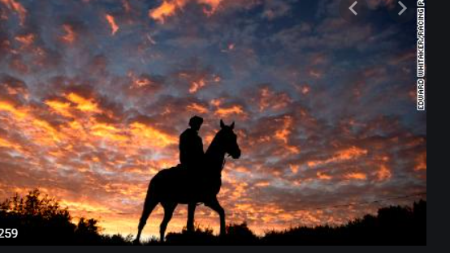

# VENKATESH VEMULA
###### KALAKAND

Kalakand is a popular sweet made in **india**. it is made using ingridients like milk,sugar and some **dry fruits** if you want to make it special. 
 I like it because **it made by solidified, sweetened milk called Khoa**. It requires an effective reduction of the mixture to a viscous fluid, after which it can be frozen to solid and perfect to Eat and we can feel the taste of it.

---
# ORDERED LIST

## MAKING OF EGG CURRY IN PUNJABI STYLE

 #### For seasoning Eggs
1. Boil eggs.
   1. put water.
   2. turn on the gas.
   3. heat for 10 mins.
2. remove the shell from the eggs.
3. season the eggs.  

---
# UNORDERED LIST

#### For curry

* Boil eggs.
   * put water.
   * turn on the gas.
   * heat for 10 mins.
* remove the shell from the eggs.
* season the eggs.

 
---
 if u want to know more about me [About me](https://github.com/Vemula23/assignment2-Vemula/blob/main/AboutMe.md) 
 ---

 
 ###### Places to visit in Guntur
 # 1.Amaravati
Amaravathi is a city located on the banks of Krishna River, in Guntur district of the Indian state of Andhra Pradesh.Amaravathi was founded by Raja Vasireddy Venkatadri Nayudu in 1790s as the new capital of his zamindari estate. He moved there from his former capital Chintapalli in protest of alleged mistreatment by the British East India Company.Amaralingeswara temple in the village is one of the Pancharama Kshetras for the Hindus. The place was also a historic Buddhist site, depicted by the presence of Amaravati Stupa built during the 2nd century BCE and the 3rd century CE.

| Location  |      Hours    |  Amount |
|:----------|:-------------:|--------:|
|   Amaravati |   2hrs        |  6000   | 

# 2. PVR Mall
PVR Cinemas is a film entertainment company in India. The company started as a joint venture agreement between Priya Exhibitors Private Limited and Village Roadshow Limited in 1995 with 60:40 ratio. It began its commercial operations in June 1997.

| Location  |      Hours    |  Amount |
|:----------|:-------------:|--------:|
|  PVR Mall |   3hrs       |  20000   |  

# 3.Nagarjuna Sagar
Nagarjuna Sagar Dam is a masonry dam across the Krishna River at Nagarjuna Sagar which straddles the border between Guntur district in Andhra Pradesh and Nalgonda district in Telangana. Constructed between 1955 and 1967, the dam created a water reservoir with gross storage capacity of 11.472 billion cubic metres.

| Location  |      Hours    |  Amount |
|:----------|:-------------:|--------:|
|  Nagarjuna Sagar |   3hrs        |  5000   |

# 4. Prakasam barriage
The structure of the Prakasam Barrage stretches 1223.5 m across the Krishna River connecting Krishna and Guntur districts. The barrage serves also as a road bridge and spans over a lake. The three canals associated with the barrage run through the city of Vijayawada, crossing it and giving it a Venetian appearance. 

| Location  |      Hours    |  Amount |
|:----------|:-------------:|--------:|
| prakasam Barriage|    1hr        | 2000    |

---
> I love you the more in that I believe you had liked me for my own sake and for nothing else.
                                                                                          ~John Keats

> Let us sacrifice our today so that our children can have a better tomorrow.
                     ~ A. P. J.AbdulKalam   
---                                                                                                            
#### Live script
> LiveScript is a functional programming language that compiles to JavaScript. It was created by Jeremy Ashkenas—the creator of CoffeeScript—along with Satoshi Muramaki, George Zahariev, and many others. Not to be confused with JavaScript (for a brief period in the 1990s, LiveScript was the name of JavaScript).

[learn more](https://en.wikipedia.org/wiki/LiveScript)
~~~hello-world = ->
  console.log 'Hello, World!'
  111 |> (+) 222
 > 333

(+) 1 2
 > 3
 ~~~
 [code source](https://en.wikipedia.org/wiki/LiveScript)
 ---

 

